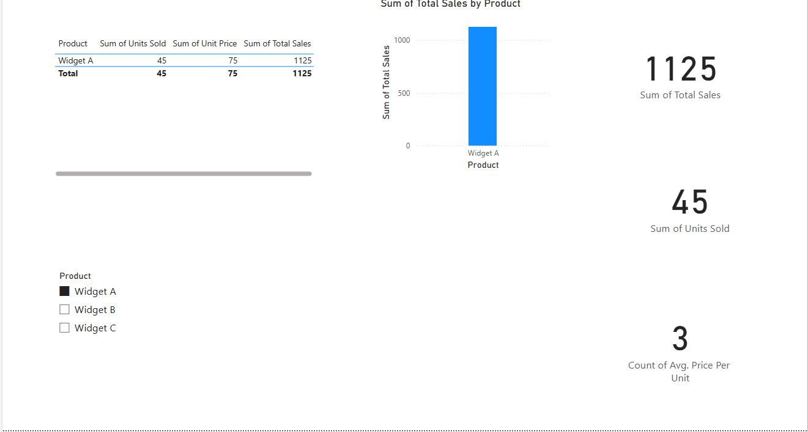

# Power BI Sales Dashboard

This project is a beginner-friendly interactive dashboard built using Power BI. It analyzes product sales and performance using visual elements like:

- 📊 **Bar Chart**: Sales by Product
- 📋 **Table**: Product details including Units Sold, Price, and Total Sales
- 🎯 **KPI Cards**: Total Sales, Average Price, and Units Sold
- 🎛 **Slicer**: Filter data by Product

## 📁 File

- `powerbi-sales-dashboard.pbix` — Power BI report file

## 🧠 Skills Demonstrated

- Data import and cleaning
- Visual design and formatting
- Interactive filtering with slicers
- Data modeling and metric calculation

## 🚀 Tools Used

- Microsoft Power BI

## 🗂️ How to Use

1. Download the `.pbix` file
2. Open it in Power BI Desktop
3. Explore the dashboard by clicking slicers and visuals

---

✅ Built as part of my portfolio while transitioning into the data analytics field.
## 🔎 Power BI – Sales Dashboard

This dashboard visualizes sales data by product and region. It includes:

- Total sales by product category
- Sales by region
- Key KPIs (total, average, highest, lowest)
- Slicers for interactivity

### 🧰 Tools Used:
- Microsoft Power BI

#

